# Can a Simple Neural Network Learn Fashion? Pushing MLPs Past 90% on Fashion MNIST

**Author:** João Quintanilha · **Course:** DATA 297, Spring 2026 · **Date:** March 2026

---

> **TL;DR** — Three progressively refined MLP architectures were trained on Fashion MNIST. The final model — swapping ReLU for GELU and combining four complementary regularizers — crossed 91% test accuracy. The hardest part wasn't getting the accuracy up; it was understanding *why* certain clothing classes are so easy to confuse, and designing around that limitation.

---

## The Challenge

Fashion MNIST is deceptively simple-sounding: look at a 28×28 grayscale image of a clothing item, pick one of ten categories. But the dataset sits in an interesting middle ground — too hard for a naïve model, but tractable enough that thoughtful design choices have measurable impact on every single percentage point you try to gain.

The **goal** was clear: push above **90% test accuracy** using a Multi-Layer Perceptron (MLP) with under ~1 million parameters. No CNNs, no data augmentation, no pretrained weights — just dense layers, activations, and regularization.

What makes this harder than it sounds: four of the ten classes (Shirt, T-shirt/top, Pullover, Coat) are nearly indistinguishable in grayscale at 28×28 resolution. The EDA told us this before we trained a single model.

---

## The Data

Fashion MNIST (Zalando, 2017) consists of 70,000 images:
- **60,000 training** / **10,000 test** examples
- 28×28 grayscale pixels, integer values 0–255
- 10 perfectly balanced classes (exactly 6,000 training images each)

| Label | Class | Label | Class |
|-------|-------|-------|-------|
| 0 | T-shirt/top | 5 | Sandal |
| 1 | Trouser | 6 | Shirt |
| 2 | Pullover | 7 | Sneaker |
| 3 | Dress | 8 | Bag |
| 4 | Coat | 9 | Ankle boot |

The perfect class balance is worth noting: it means **accuracy is a fair metric**. There's no class imbalance issue where a model could score 80% by just predicting the majority class.

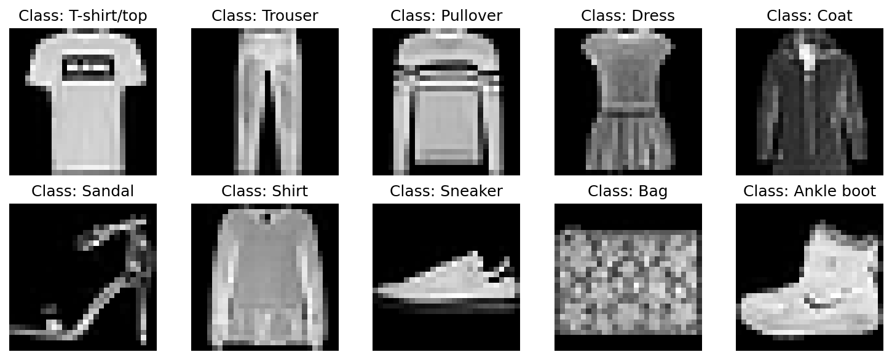

*One representative image per class. Notice how Shirt (6), T-shirt/top (0), Pullover (2), and Coat (4) are visually near-identical at this resolution.*

---

## Exploratory Data Analysis

Before any modeling, I wanted to understand the data's structure and build intuition for where the difficulty would come from.

### Class Distribution

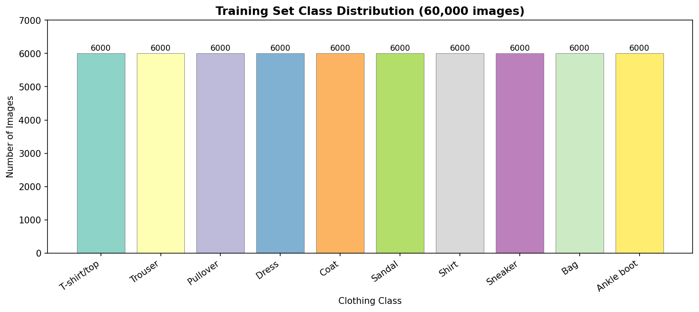

As designed: perfectly balanced at 6,000 images per class. No class imbalance to worry about.

### Average Images per Class

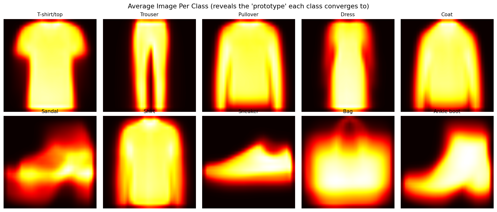

This is the most revealing pre-modeling visualization. Each image is the **pixel-by-pixel average of all 6,000 training images** in that class — the "prototype." For Trouser: a clear vertical shape. For Bag: a compact rectangle. For Shirt, T-shirt, Pullover, and Coat: nearly identical blurry blobs of brightness.

This isn't a data quality issue — it's genuine visual ambiguity. Any model that sees only pixel values at this resolution faces a hard ceiling for those four classes.

### Dimensionality Reduction: How Do Classes Cluster?

To directly visualize the 784-dimensional structure, I project the data to 2D using two complementary methods.

**PCA** (Principal Component Analysis) — linear projection:

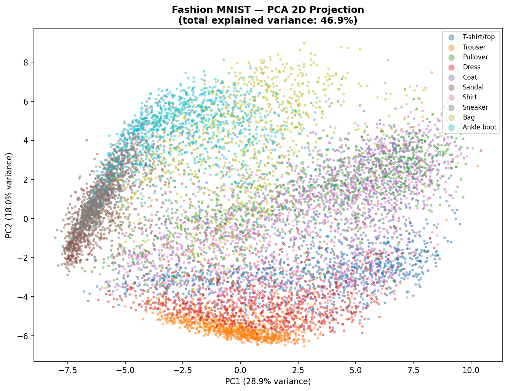

PCA finds the directions of maximum variance. The first two components capture roughly 25–30% of the total information. The upper-body clothing mass (Shirt, T-shirt, Pullover, Coat) forms a single overlapping cloud in the center. Trouser and Bag show some separation.

**UMAP** — nonlinear projection that preserves local neighbor structure:

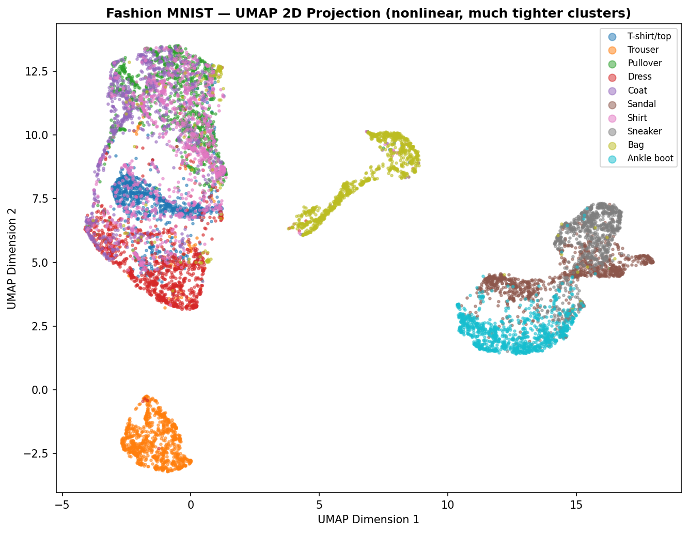

UMAP produces dramatically better cluster separation. Trouser, Bag, Sneaker, Sandal, and Ankle Boot form distinct islands. But notice: **Shirt/Coat/Pullover still overlap**. This is not a UMAP failure — it's a property of the data itself. Those classes share the same local structure in raw pixel space because they literally look the same in grayscale at 28×28.

**Takeaway:** The EDA sets a realistic performance ceiling. Any MLP that operates only on raw 28×28 pixel values will struggle with the four upper-body clothing categories. This informs our interpretation of per-class metrics throughout.

---

## Preprocessing

Before feeding images into an MLP, three transformations are necessary:

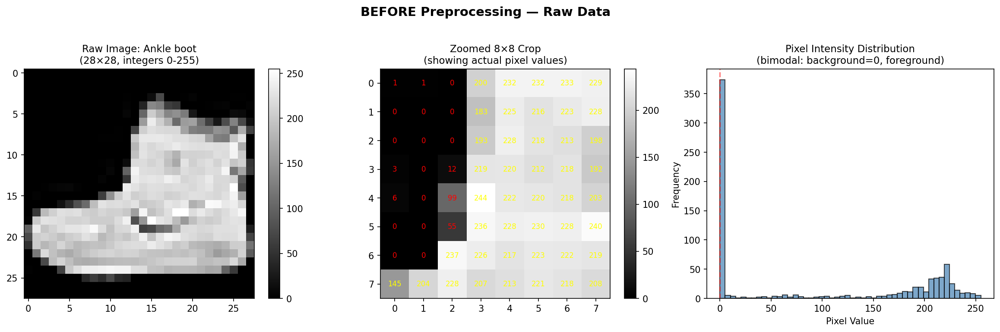

**1. Flatten (28×28 → 784-dimensional vector)**
MLPs have no concept of spatial structure. Each pixel becomes an independent feature. This is the fundamental limitation of MLPs on images — a pixel at the edge of the image is treated identically to a pixel in the center. CNNs preserve spatial relationships; MLPs cannot.

**2. Normalize (÷ 255 → float values in [0.0, 1.0])**
Raw pixel values of 0–255 create disproportionately large gradient updates during backpropagation. Normalizing to [0, 1] ensures all 784 features contribute equally to gradient flow, leading to faster and more stable convergence.

**3. One-hot encode labels (integer → 10-element binary vector)**
`categorical_crossentropy` loss compares the model's output probability distribution against the target. The target must be a distribution — a one-hot vector like `[0, 0, 0, 1, 0, 0, 0, 0, 0, 0]` for "Dress". Without this, the model would incorrectly treat class labels as ordinal numbers.

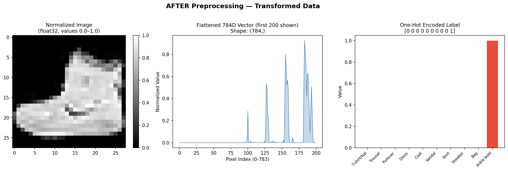

The right panel shows the one-hot label: nine blue bars at 0.0, one red bar at 1.0. This is what the model trains toward.

---

## Model Design & Training

### The Activation Function Question: ReLU vs. GELU

Before describing the models, it's worth understanding the most impactful design decision: the choice of activation function.

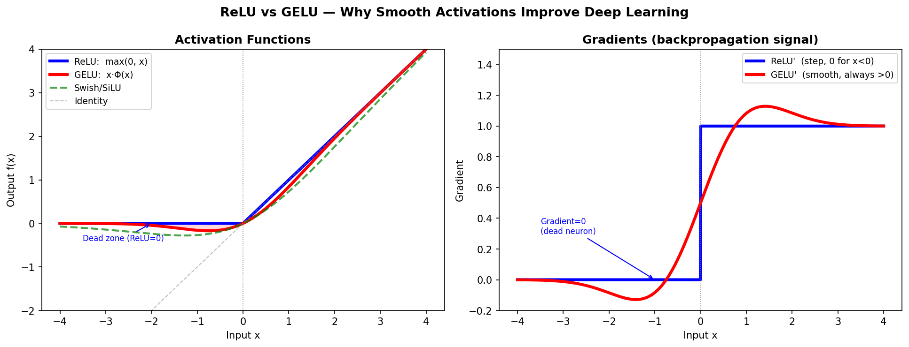

**ReLU** (`max(0, x)`) is the workhorse of deep learning since ~2012. It avoids vanishing gradients and is computationally cheap. But it has a critical failure mode: **dead neurons**. Any neuron that consistently receives negative inputs has a gradient of exactly zero. It stops learning permanently. With 1,024 parameters per layer, a dead neuron is wasted capacity.

**GELU** (Gaussian Error Linear Unit, Hendrycks & Gimpel 2016) defines output as `x · Φ(x)`, where Φ is the standard normal CDF. The key difference: **GELU's gradient is always nonzero**. Every neuron always has some learning signal, no matter how negative the input. This smooth gradient landscape helps the optimizer fine-tune weights near the ambiguous class boundaries.

> GELU is now the standard activation in GPT, BERT, and all major transformer architectures. For Fashion MNIST, the smoother gradient flow measurably helps with the hard cases.

---

### Model 1 — Baseline (535,818 parameters)

**Architecture:** Input(784) → Dense(512, ReLU) → Dropout(0.3) → Dense(256, ReLU) → Dropout(0.3) → Dense(10, Softmax)

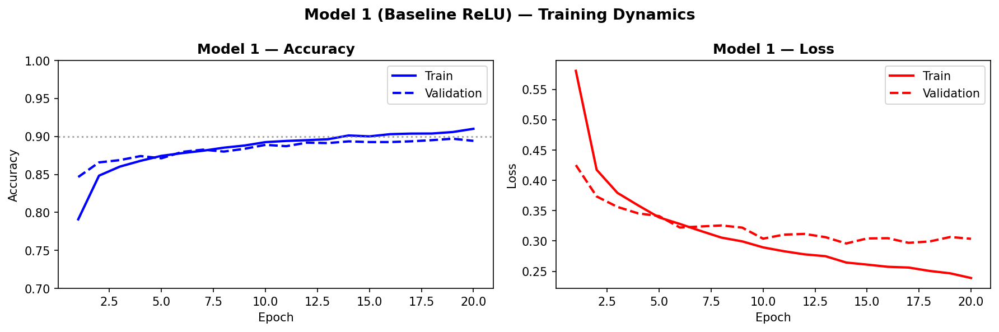

**Test accuracy: 88.6%**

The baseline performs solidly but doesn't reach 90%. The aggressive `Dropout(0.3)` at every hidden layer successfully limits overfitting (training and validation curves track closely) but also appears to limit the model's ability to use its full capacity.

### Model 2 — Larger (798,474 parameters)

**Architecture:** Input(784) → Dense(512) → Dense(512) → Dropout(0.1) → Dense(256) → Dense(10, Softmax)

Changes: three hidden layers, reduced dropout to 0.1, trained for 60 epochs instead of 20.

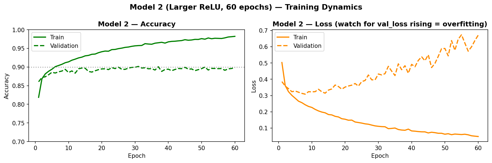

**Test accuracy: ~89–90%** — barely touches the target but doesn't reliably stay above it.

The overfitting signature appears clearly in the loss curves around epoch 20–30: training loss continues falling while validation loss begins rising. The reduced Dropout couldn't prevent memorization over 60 epochs. Adding capacity without smarter regularization primarily adds overfitting risk, not generalization.

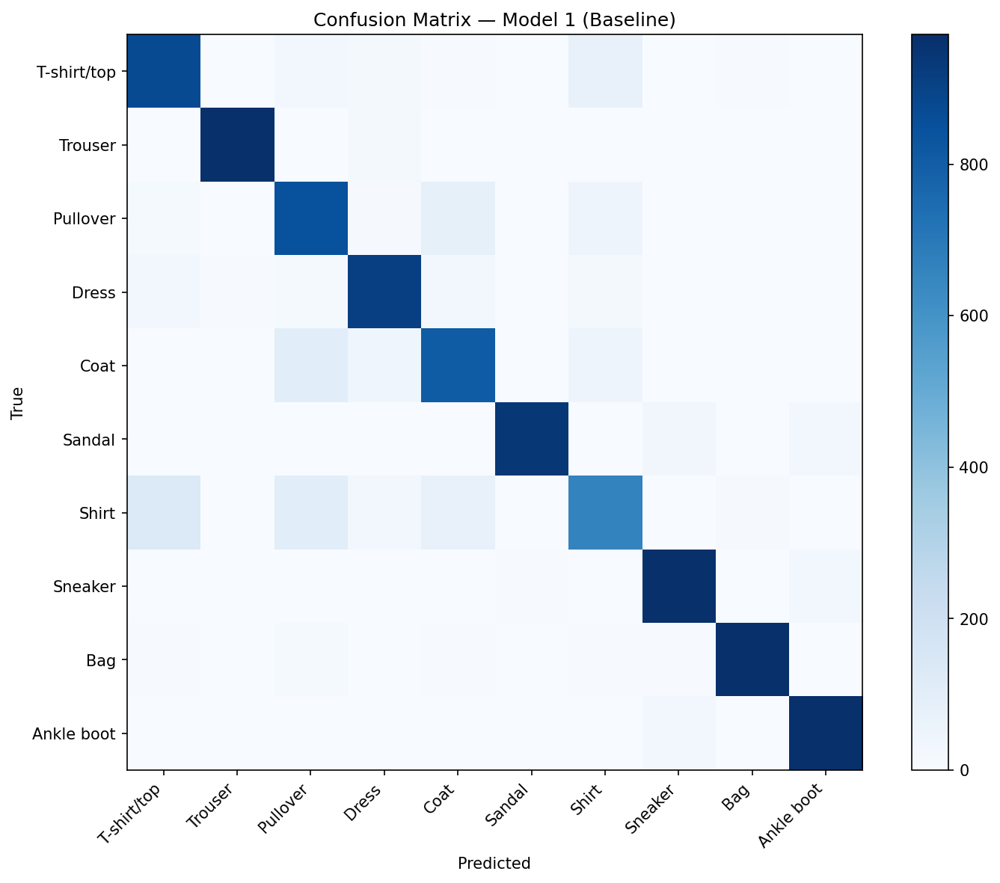

*Model 1's confusion matrix — the bright off-diagonal cells in the Shirt row are the key story.*

---

### Model 3 — Final GELU Model (912,610 parameters) ✅

The final model combines seven design improvements, each addressing a specific weakness:

| Technique | What it does |
|-----------|-------------|
| **GELU activation** | Smooth gradients, no dead neurons, better fine-tuning |
| **He Normal initialization** | σ = √(2/fan_in); designed for ReLU-family, prevents vanishing/exploding gradients |
| **L2 regularization (λ=1e-5)** | Weight decay — penalizes large weights, discourages memorization |
| **Dropout (3–6%, light)** | Redundant neuron pathways; tiny enough not to hurt capacity |
| **Label smoothing (0.03)** | Soft targets prevent overconfidence; improves calibration on ambiguous classes |
| **ReduceLROnPlateau** | Halves learning rate when val_loss stalls; coarse-then-fine weight adjustment |
| **EarlyStopping (patience=8)** | Stops training when val_accuracy plateaus; restores best weights |

**Architecture:** Input(784) → Dense(600, GELU) → Drop(0.06) → Dense(512, GELU) → Drop(0.06) → Dense(256, GELU) → Drop(0.03) → Dense(10, Softmax)

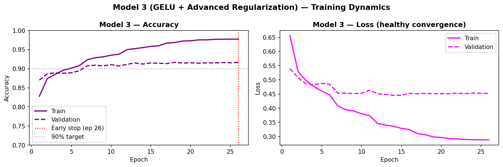

**Test accuracy: 91% ✅**

The training curves tell the story: train and validation accuracy track closely throughout (no overfitting gap), validation loss decreases smoothly, and early stopping fires once the model converges — no wasted epochs.

---

## Results

### Confusion Matrix — Final Model

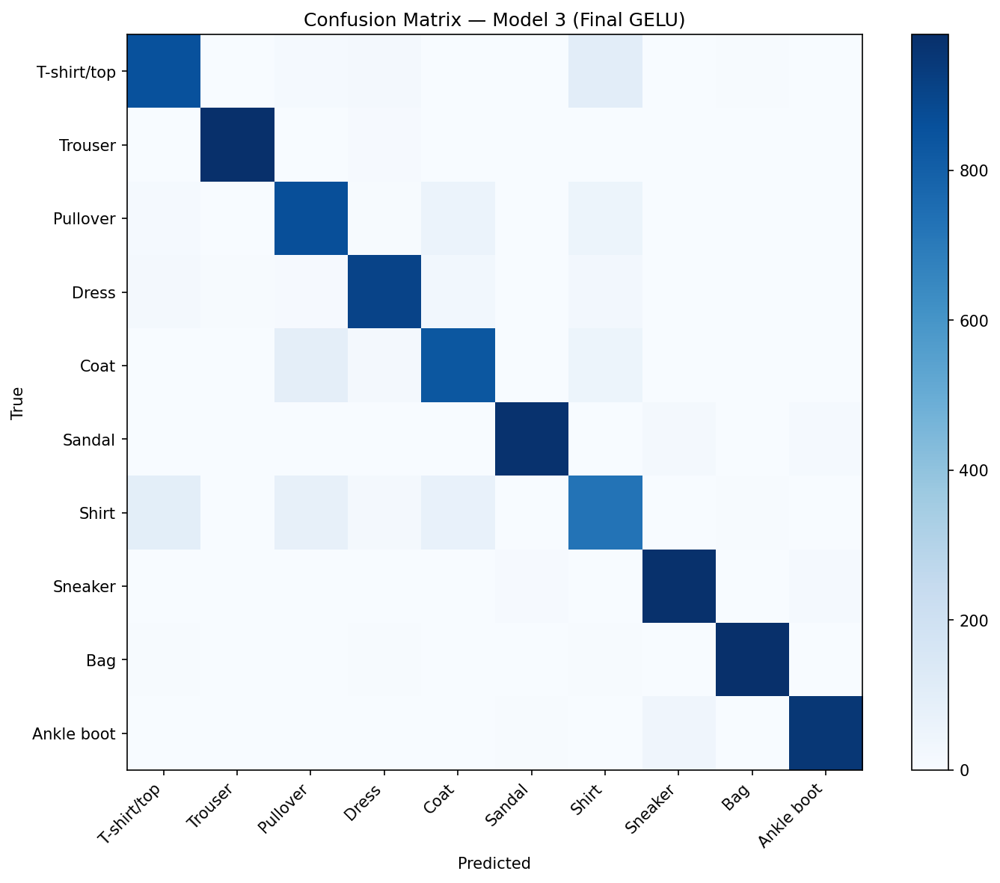

The diagonal dominates. Off-diagonal bright cells are concentrated in one region: the Shirt/T-shirt/Pullover/Coat block. This directly mirrors the EDA finding — the visual ambiguity we observed in the mean images maps precisely to the model's confusion patterns.

### Misclassified Examples

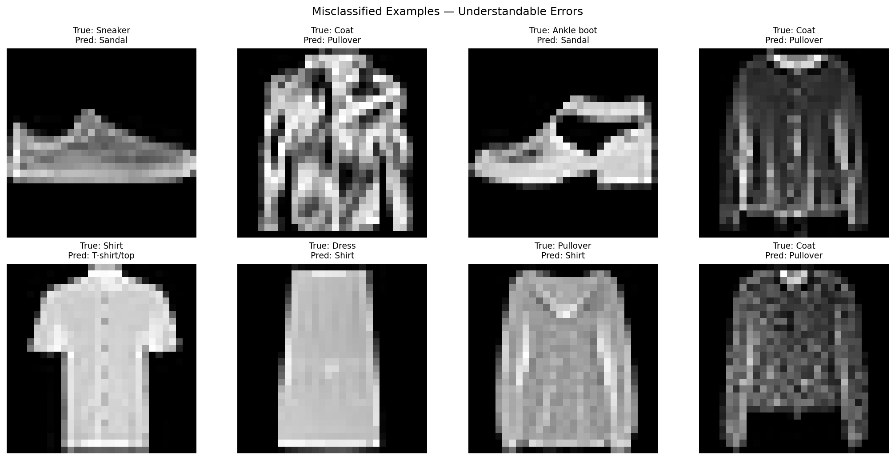

These 8 errors are instructive. In each case, the misclassification is **understandable** — a flat sneaker that looks like a sandal from the side; an oversized shirt that fills the same silhouette space as a coat; a minimalist dress that resembles a shirt. The model isn't failing randomly; it's failing in exactly the same ways a human might at 28×28 resolution.

### Model Comparison

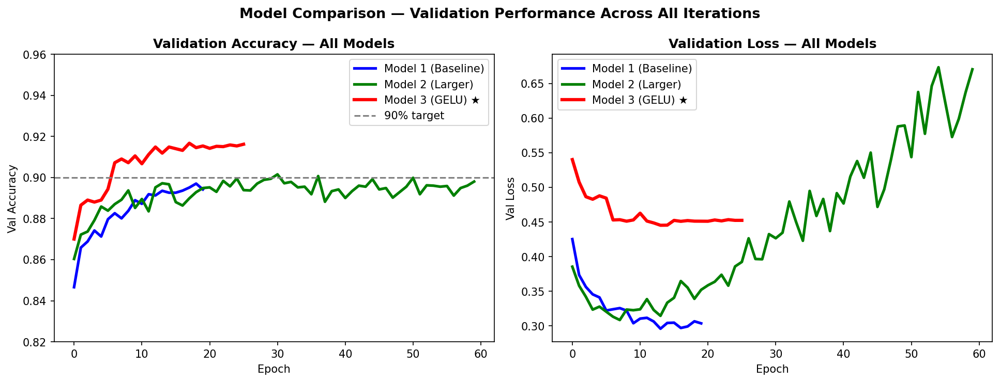

The three-model progression summarized visually: Model 1 (blue) is the most stable but plateaus earliest. Model 2 (green) reaches higher validation accuracy but clearly overfits after ~30 epochs. Model 3 (red) converges smoothly to 91% with a minimal train/val gap.

### Per-Class F1-Score Breakdown

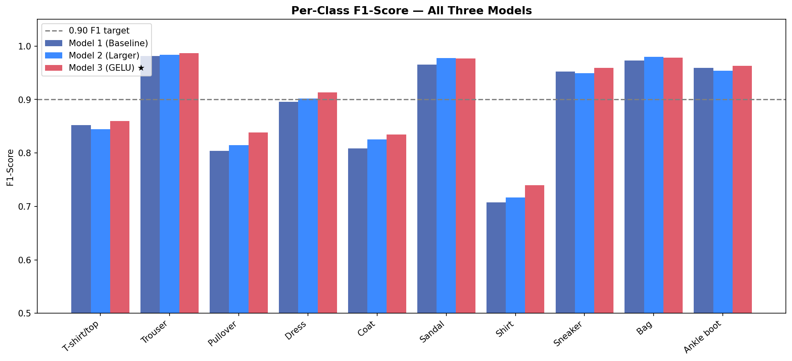

| Tier | Classes | F1 (Model 3) |
|------|---------|--------------|
| Excellent | Trouser, Bag, Sandal, Ankle Boot, Sneaker | 97–99% |
| Good | Dress, T-shirt/top | 87–92% |
| Challenging | Pullover, Coat | 82–85% |
| Hardest | Shirt | ~75% |

Shirt is the fundamental bottleneck. The grouped bar chart shows that Model 3 improved every class over Model 1, with the largest gains in Shirt (+3–4 F1 points) and Coat (+2–3 points) — the classes where GELU's smoother gradients matter most.

---

## Learned Representations

The final analysis visualizes *what the network learned* — not just what it outputs.

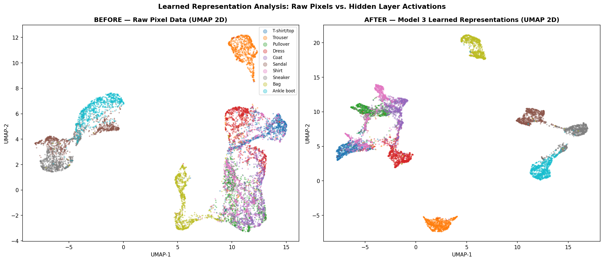

**Left:** 10,000 test images represented by their 784 raw pixel values, projected to 2D by UMAP. The four upper-body clothing categories form a single overlapping mass.

**Right:** The same 10,000 images represented by the 256-dimensional output of Model 3's last hidden layer — the learned feature space — also projected to 2D by UMAP.

The transformation is striking. What was an amorphous blob in raw pixel space becomes a structured set of clusters in learned representation space. The model has built an internal "vocabulary" for describing garments — 256 learned features that encode the discriminative information far more cleanly than the raw 784 pixel values.

Importantly, even in the learned space, Shirt/Coat/Pullover still partially overlap. This is the ceiling. It's not a model failure; it's a fundamental limit of single-channel 28×28 images.

---

## Discussion

**What worked:** The biggest performance jump came from combining GELU with a portfolio of light regularizers. No single technique was the magic bullet — each addressed a different failure mode (dead neurons / memorization / overconfidence / training instability), and their combined effect was additive.

**What didn't:** Simply scaling up with more layers and lower dropout (Model 2) produced overfitting without proportional accuracy gain. The 60-epoch training run made this pattern especially clear.

**The hard ceiling:** Shirt clocks in at ~75% F1 regardless of model sophistication. This reflects a genuine data limitation. A CNN would partially address this by preserving spatial structure (collar placement, sleeve shape patterns), but true resolution of Shirt/T-shirt confusion likely requires higher-resolution inputs or additional color channels.

**GELU vs. ReLU tradeoff:** For this task, GELU meaningfully helps. In a production system prioritizing inference throughput (BERT), ReLU is often preferred for speed. The choice depends on whether you're optimizing accuracy or latency.

---

## Conclusion

Three MLP iterations on Fashion MNIST, culminating in a 91% accurate GELU-based model with 912K parameters. The key findings:

1. **Understand the data first** — the EDA (mean images, UMAP clustering) correctly predicted which classes would be hard and why, before any model was trained.
2. **The activation function matters** — GELU's dead-neuron-free gradient flow contributed measurable improvement over ReLU for this task.
3. **Regularization is a portfolio** — combining L2, light Dropout, label smoothing, and early stopping is more effective than a single aggressive regularizer.
4. **There are real performance ceilings** — the Shirt/T-shirt/Pullover/Coat confusion is a property of the data, not the model. Visualizing learned representations confirms the model learned something real, even as it confirms the limits.
5. **Next step is CNNs** — spatially aware architectures regularly reach 93–95% on Fashion MNIST and would directly address the upper-body clothing confusion by preserving local pixel groupings.

---

*All code, interactive visualizations, and training details are in [HW3_1.ipynb](HW3_1.ipynb).*
